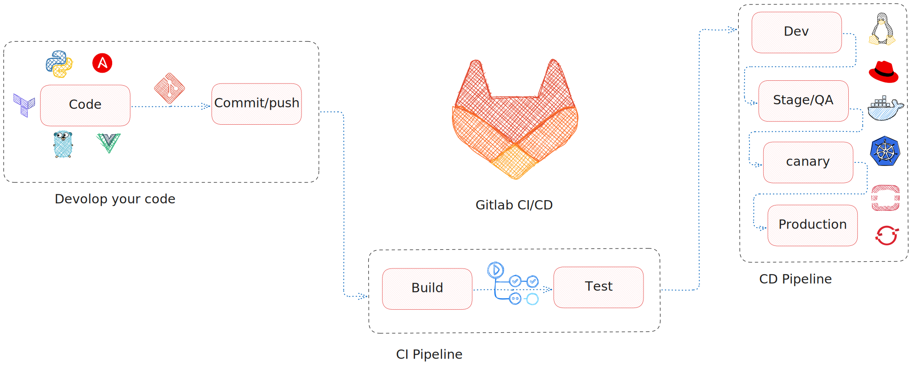

# automation-with-gitlab

# Servers Information

| Name              | IP Address            | OS        |
| :---------------- |  :------:             |  ----:    |
| Gitlab            |   192.167.178.111     | Debian 12 |
| Runner            |   192.167.178.112     | Debian 12 |
| Registry          |   192.167.178.113     | Debian 12 |

Install and configure gitlab on server

Install and configure gitlab with external database

Install and configure gitlab on docker and docker compose

Install and configure gitlab runner on server

Install and configure gitlab runner on docker and docker compose

Install and configure image reginstry on gitlab

Install and configure image reginstry on nexus with docker and docker compose

