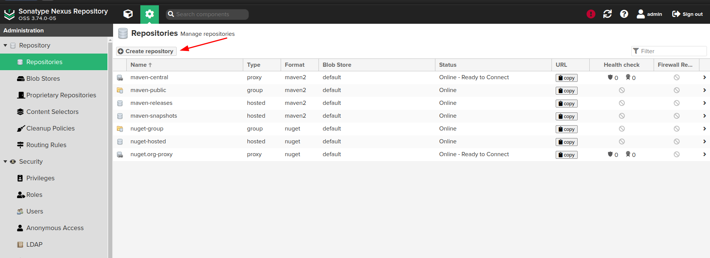
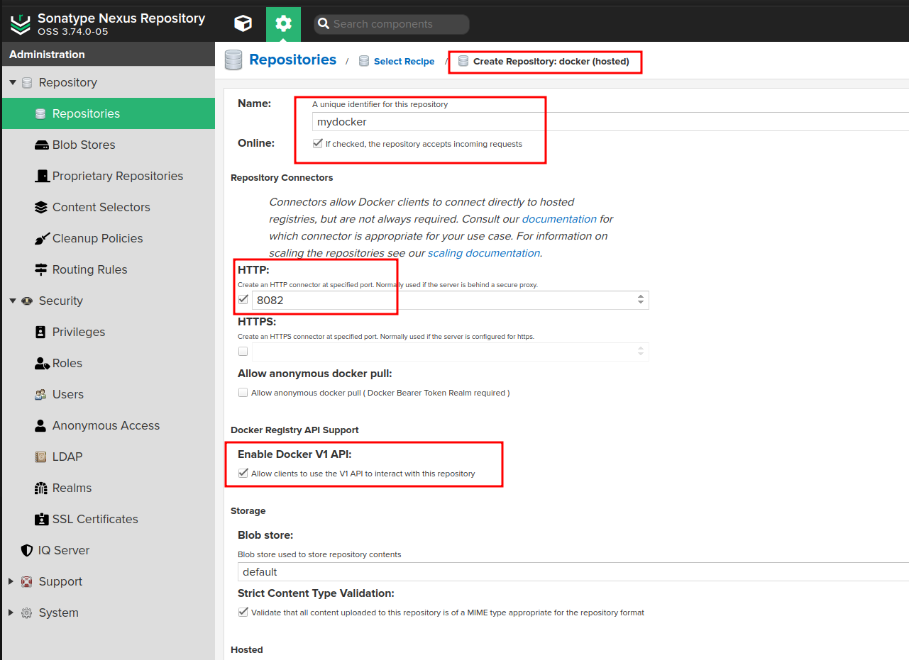

Install docker and docker compose(َUse Install_docker.sh) to install docker

https://docs.docker.com/engine/install/debian/


Install nexus registry with docker and docker compose

```bash
sudo docker compose up -d
```

Run command on server

```
chown -R 200:200 /data/registry/
chown -R 200:200 /data/registry/nexus-data
```

admin password is:

```
docker exec -it nexus cat /nexus-data/admin.password
```

Copy `nexus` and `docker` file to `/etc/nginx/site-avalible`

sudo apt-get install python3-certbot-ngin nginx
certbot --nginx -d YOUR_DOMAIN

## For wildcard run:
sudo certbot certonly --manual --preferred-challenges=dns --server https://acme-v02.api.letsencrypt.org/directory --manual-public-ip-logging-ok -d "*.YOUR_DOMAIN"

```
ln -s /etc/nginx/sites-available/nexus /etc/nginx/sites-enabled/
ln -s /etc/nginx/sites-available/docker /etc/nginx/sites-enabled/
unlink /etc/nginx/sites-enabled/default
```

### Test nginx config and reload

```bash
sudo nginx -t
sudo nginx -s reload
sudo systemctl restart nginx
```

### Open browser and test nexus and docker registry

https://registry.anisa.local

### Create docker registry repository

- login to docker registry
- create repository





### Login to docker registry in your cli

```bash
docker login docker.anisa.local
```

If you get bellow error it's because of HTTPS

```bash
Error response from daemon: Get "https://docker.anisa.local/v2/": http: server gave HTTP response to HTTPS client
```

You should add insecure registry in your docker config

```bash
sudo vim /etc/docker/daemon.json

{
    "insecure-registries": ["docker.anisa.local"]
}
```

Restart docker service

```bash
sudo systemctl restart docker
sudo systemctl status docker
```

### Login to docker registry in your cli

```bash
root@debian:~# docker login docker.anisa.local

Username: admin
Password: 
WARNING! Your password will be stored unencrypted in /root/.docker/config.json.
Configure a credential helper to remove this warning. See
https://docs.docker.com/engine/reference/commandline/login/#credential-stores

Login Succeeded
```

### Push image to docker registry

Pull image from docker hub for example nginx image

```bash
docker pull nginx
```

Tag image with new name

```bash
docker tag nginx:latest docker.anisa.local/nginx:1.0.0
```

Push image to docker registry

```bash
docker push docker.anisa.local/nginx:1.0.0
```

```
root@debian:~# docker push docker.anisa.local/nginx:1.0.0
The push refers to repository [docker.anisa.local/nginx]
16d387d1e121: Pushed 
d77616dbf44e: Pushed 
1013a9d59e8c: Pushed 
3f49e906ca03: Pushed 
fb34e34b4693: Pushed 
93a30ca6feb4: Pushed 
c3548211b826: Pushed 
1.0.0: digest: sha256:c20cc0fb2627491f6d0c6eb08eb3a0f892c26effd559607742128b65f11436e1 size: 1778
root@debian:~# 
```

### Pull image from your local docker registry

For test remove images and pull image again

```bash
docker rmi -f docker.anisa.local/nginx:1.0.0 nginx:latest
docker pull docker.anisa.local/nginx:1.0.0
```
